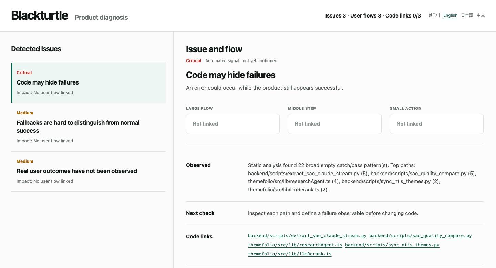
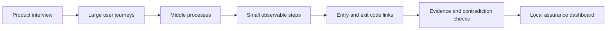

# Agentlas SEI

### Find the gap between code that passes and products that work.



Agentlas SEI is a local-first assurance agent for existing software projects.
It maps the product from large user journeys down to small observable steps,
connects those steps to code and evidence, and shows where the team knows,
assumes, or cannot yet prove that the product works.

It runs against a local project folder. GitHub is optional. Source code and
interview answers stay on your machine by default.

## Install and run with one prompt

Give this prompt to Codex, Claude Code, Gemini CLI, Antigravity, or another
coding agent:

```text
Install https://github.com/agentlas-ai/agentlas-sei and run SEI on this project.
Interview me first, map the large, middle, and small user flows, inspect evidence
gaps, then open the dashboard in English.
```

Or run it directly:

```bash
git clone https://github.com/agentlas-ai/agentlas-sei.git
cd agentlas-sei
./scripts/install.sh
sei /path/to/project
```

The first run interviews you about the product, maps the project, performs a
deterministic inspection, writes local assurance state, and opens a tokenized
dashboard on `127.0.0.1`.

## The problem

Most engineering tools answer narrow questions:

| A normal check can show | It usually cannot prove |
| --- | --- |
| a test passed | the user completed the intended journey |
| no exception was thrown | a silent fallback did not hide failure |
| a function behaves correctly | the complete cross-screen flow works |
| documentation exists | the code still matches the documented intent |
| a metric changed | the change produced the right user outcome |

This leaves a second defect surface beyond code bugs: stale assumptions,
unowned decisions, missing observability, contradictory product intent, and
flows that nobody can reconstruct end to end. SEI treats those as cognitive,
intent, evidence, and governance debt—not as vague documentation problems.

## How SEI works



SEI compares five layers:

1. what the product intends;
2. what maintainers believe;
3. what the code implements;
4. what runtime evidence shows;
5. what users actually achieve.

The result is not a magical “all bugs found” claim. It is a reviewable map of
claims, flows, evidence gaps, and issue candidates. Missing links remain marked
as unknown instead of being guessed.

## What you get

- a built-in product-intent interview;
- large → middle → small user-flow maps;
- entry-code and exit-code slots for every small flow;
- bounded project and code maps;
- deterministic technical and cognitive debt candidates;
- contradiction and evidence-gap detection;
- an append-only local ledger for findings, interviews, and change reviews;
- a multilingual local dashboard in Korean, English, Japanese, and Chinese;
- digest-bound review gates for high-risk commits and pushes;
- an optional, privacy-bounded OpenAI-compatible LLM pass.

SEI is read-only by default. v0.3.0 does not mutate application code, run
production experiments, approve repairs, or deploy.

## Dashboard

Open the dashboard in English:

```bash
sei dashboard /path/to/project --lang en
```

Available languages:

```text
auto | ko | en | ja | zh
```

The dashboard presents the issue list and the selected issue side by side, then
connects it to the relevant large, middle, and small flow. Verified relative
code references can open in VS Code. Unverified links stay visibly unresolved.

The server binds only to `127.0.0.1`, uses a random URL token, and serves no
project files.

## Installation

Python 3.11 or newer is required.

### Shell

```bash
git clone https://github.com/agentlas-ai/agentlas-sei.git
cd agentlas-sei
./scripts/install.sh
sei /path/to/project
```

### Codex

```bash
codex plugin marketplace add https://github.com/agentlas-ai/agentlas-sei.git
codex plugin add agentlas-sei@agentlas-sei
```

Invoke it with:

```text
$sei
```

### Claude Code, Gemini CLI, and Antigravity

The installer adds the local host adapters. Invoke them with:

```text
/sei
```

### Development install

```bash
python3 -m venv .venv
.venv/bin/python -m pip install -e .
```

## Core commands

| Goal | Command |
| --- | --- |
| Interview, inspect, and open the dashboard | `sei /path/to/project` |
| Open only the dashboard | `sei dashboard /path/to/project --lang en` |
| Create local SEI state | `sei init /path/to/project` |
| Refresh project and code maps | `sei map /path/to/project` |
| Run the product interview | `sei interview /path/to/project` |
| Inspect without an LLM | `sei inspect /path/to/project` |
| Inspect with an optional LLM | `sei inspect /path/to/project --llm` |
| Check state and privacy invariants | `sei validate /path/to/project` |
| Audit SEI itself | `sei self-audit /path/to/agentlas-sei` |
| Install commit and push gates | `sei hooks install /path/to/project` |
| Remove managed gates | `sei hooks uninstall /path/to/project` |

Use `sei <command> --help` for command-specific options.

## Local assurance state

SEI writes its working state inside the inspected project:

```text
.sei/
├── config.json
├── boundary.json
├── status.json
├── maps/
│   ├── project-map.json
│   └── code-map.json
├── memory/interviews.jsonl
├── registry/
│   ├── claims.jsonl
│   └── flows.jsonl
├── evidence/evidence.jsonl
├── findings/findings.jsonl
├── decisions/change-reviews.jsonl
└── reports/latest-inspection.md
```

`.sei/` is local assurance state and should not be published by default.

## Risk-based change review

SEI does not interrupt every commit. Its managed hooks request a review when an
exact change includes signals such as:

- broad or unusually large change surfaces;
- authentication, payment, schema, migration, release, or permission paths;
- fallback, retry, exception, rollback, or silent-failure behavior;
- new TODO, FIXME, HACK, or temporary markers;
- source changes without corresponding test or knowledge changes.

Install the hooks:

```bash
sei hooks install /path/to/project
```

When a gate requests review:

```bash
sei review /path/to/project \
  --stage pre-commit \
  --reviewer maintainer-name
```

The review is bound to the exact change digest. If the diff changes, the
receipt becomes invalid. Existing hooks are never overwritten unless
`--force` is supplied; forced installation creates a backup first.

## Optional LLM

The deterministic inspection works without an LLM. LLM use is explicit:

```bash
export SEI_LLM_BASE_URL=http://localhost:11434/v1
export SEI_LLM_MODEL=your-model
sei inspect /path/to/project --llm
```

For a hosted OpenAI-compatible endpoint, also set:

```bash
export SEI_LLM_API_KEY=...
```

The LLM receives bounded counts, risk signals, claim IDs and states,
observables, and finding summaries. Source code, file paths, and interview
answers are excluded. The model may propose competing hypotheses; it cannot
confirm a defect or approve a change.

## Privacy and authority boundaries

- local folder first; no GitHub connection is required;
- no network call unless `--llm` is explicitly supplied;
- no symlink traversal;
- bounded file and byte scan budgets;
- known secret filenames are excluded;
- source content is analyzed in memory and is not copied into the ledger;
- interview answers are never sent to the LLM;
- the dashboard serves no source files;
- mutation and deployment remain outside the v0.3.0 authority boundary.

## Current scope

v0.3.0 is an alpha production foundation. The local CLI, interview, maps,
deterministic inspection, dashboard, validation contracts, and risk gates are
implemented. Runtime telemetry adapters, outcome adapters, controlled
experiments, and repair execution remain future work.

Apache-2.0. Maintained by Agentlas — appbridge@appbridge.co.kr.
